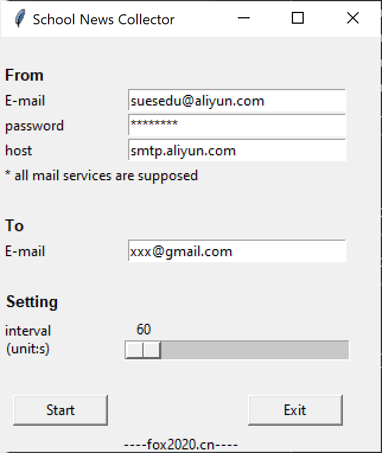

# 功能
定时从学校网站抓取最新闻和通知到本地归档，同时可以选择是否将之发送到指定的邮箱，每抓取到十条信息汇总进行一次邮件推送。邮件示例如下：

目前可以抓取的页面包含：

1. 学校要闻
2. 学科建设新闻
3. 校园快讯
4. 学术报告
5. 学校公告
6. 教学通知
7. 科研通知
8. 官方微信
9. 媒体聚焦
10. 学校校报
11. 服装学院新闻
12. 研究生院通知公告

欢迎提出需求持续更新...

# 语言
python 3

# 模块
1. requests
2. bs4
3. yagmail
4. tkinter
5. time
6. re

*推荐使用Pycharm安装及运行*

# 运行步骤
1. 下载文件到本地并打开
2. 执行main.py
3. 根据要求，填写是否需要发送那个邮件，抓取时间间隔（单位：秒），如果选择发送邮件需要填写发送邮箱地址。

4. 如果有更新，则会在运行窗口显示通知标题。如果无更新则会显示‘No Update’

*旧的通知保存在News_Archive.txt文件中，如果需要抓取原来的通知，删除此文件中的内容即可。*

# 其他
曾经尝试使用tkinter制作窗体，但发现并不如文字交互快捷方便，已弃用并停止开发。旧文件保存在main_UI.py中。

窗体界面如下：

